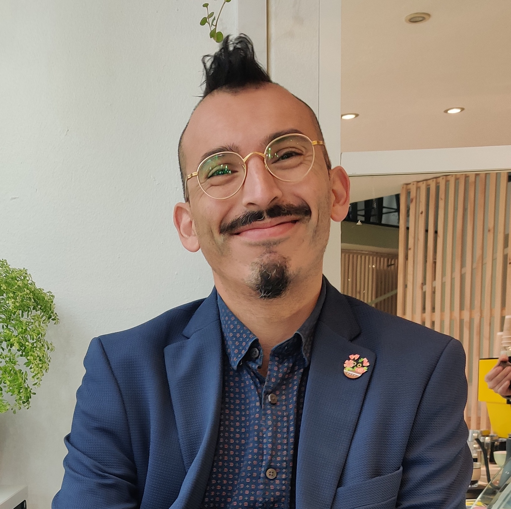

# Hi, I'm Maximiliano 
I'm a software engineer who is passionate about making AI researchers possible and creating technologies to integrate information and models across disciplines.

I enjoy:

- Designing architecture and implementing backend services using different languages (Go, Python, Nodejs, or Java).
- Deploying applications using Docker/Kubernetes or configuration management (Ansible).
- And creating good software for the community :heart:.

I recently started to learn about Mobile development using Expo.

